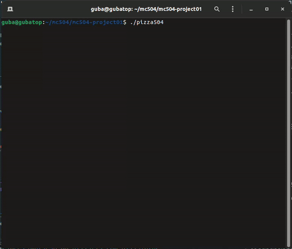

# Problema da pizzaria ─ Pizza504

## Contextualização

Em Barão Geraldo, existe uma pizzaria chamada Pizza504, que começou a fazer muito sucesso com o retorno das aulas presenciais após a pandemia. Graças a esse crescimento, o número de pedidos aumentou tanto que agora os pizzaiolos estão sempre ocupados fazendo pizza. No entanto, surge um problema: o número de fornos é limitado, e os pizzaiolos sempre se confundem ao tentar usar fornos que já estão sendo utilizados por outros funcionários, e isso causa uma grande confusão.

O código em questão ilustra o dia-a-dia dos pizzaiolos. Cada pizzaiolo é representado por uma thread, que é responsável por verificar qual forno está disponível e tentar utilizá-lo para assar uma pizza. Caso ele tenha obtido sucesso, uma unidade arbitrária de gás é descontada do forno e ele é liberado para uso em seguida.

Como o gás de cada forno é limitado, alguém deve se responsabilizar por reabastecê-lo, e é para isso que existem as threads de repositores de gás. Elas funcionam verificando se o forno já está sendo abastecido e, se não, reiniciam o valor de gás do forno selecionado para o valor máximo `GAS_INICIAL`.

## Demonstração da execução

## Pré requisitos
	- GCC (GNU Compiler Collection)
	- Biblioteca ncurses

## Como executar
Para executar o código, basta rodar o comando `make` no terminal para compilá-lo e depois executar o programa com `./pizza504`.

## Descrição do Código
O código consiste em uma simulação de pizzaria com pizzaiolos, fornos e repositores. Abaixo estão as principais partes do código:

Definições e Inicialização:

	N_PIZZAIOLOS: Número de pizzaiolos na pizzaria.
	N_REPOSITORES: Número de repositores na pizzaria.
	N_FORNOS: Número de fornos disponíveis.
	GAS_INICIAL: Quantidade máxima de gás em cada forno.
	
O código utiliza semáforos para controlar o acesso aos fornos e ao vetor de abastecimento. Além disso, existem variáveis para controlar o gás restante em cada forno e qual pizzaiolo está utilizando cada forno.

### Função `f_pizzaiolo`
Esta função é executada por cada pizzaiolo em uma thread separada. Cada pizzaiolo verifica se há um forno disponível para uso. Se houver um forno disponível, o pizzaiolo aquece a pizza no forno por um determinado tempo. O gás do forno é reduzido e, caso o gás acabe, o forno é marcado como sem gás. Após o uso, o pizzaiolo libera o forno e espera um tempo antes de utilizar outro forno.

### Função `f_repositor`
Esta função é executada por cada repositor em uma thread separada. Cada repositor verifica se há algum forno sem gás e, caso encontre, realiza o reabastecimento do gás do forno. Após o reabastecimento, o repositor libera o forno.

### Função `f_animate`
Esta função é executada em uma thread separada e é responsável por atualizar a exibição da simulação a cada intervalo de tempo utilizando a biblioteca *`ncurses`*. Ela executa as funções de animação de cada elemento para atualizar o estado da aplicação no terminal.

### Funções `printLogo`, `updateFornos` e `updateRepositores`
Essas funções são utilizadas pela thread f_animate para renderizar cada elemento no terminal. A função printLogo imprime o logo da pizzaria na tela. As funções updateFornos e updateRepositores atualizam a exibição dos fornos e repositores, respectivamente, com base nas informações do estado atual da simulação.